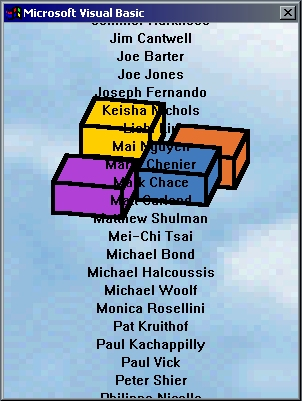

<div align="center">

## A Cheat in VB 5/6\!


</div>

### Description

This is a cheat (a secret, you may call) in VB 5/6. It displays VB credits and plays a nice MIDI file! I found it somewhere on the WWW (sorry, I don't remember exactly where).
 
### More Info
 


<span>             |<span>
---                |---
**Submitted On**   |
**By**             |[Lio\_889](https://github.com/Planet-Source-Code/PSCIndex/blob/master/ByAuthor/lio-889.md)
**Level**          |Beginner
**User Rating**    |4.6 (73 globes from 16 users)
**Compatibility**  |VB 5\.0, VB 6\.0
**Category**       |[VB function enhancement](https://github.com/Planet-Source-Code/PSCIndex/blob/master/ByCategory/vb-function-enhancement__1-25.md)
**World**          |[Visual Basic](https://github.com/Planet-Source-Code/PSCIndex/blob/master/ByWorld/visual-basic.md)
**Archive File**   |[](https://github.com/Planet-Source-Code/lio-889-a-cheat-in-vb-5-6__1-14930/archive/master.zip)


### Source Code

```
To Display VB Credits, just follow these few steps
Start Visual Basic 5.0/6.0
If you get the New Project dialog box, just click Open.
Click the View menu, point to Toolbars, and click Customize.
Go to Commands tab.
Click the Help category, and drag the About Microsoft Visual Basic item into the help menu.
Click the Modify Selection button and set the name for the newly inserted menu item to "Show VB Credits" without the quotation marks.
Click the Close button.
From the Help menu, choose Show VB Credits.
```

